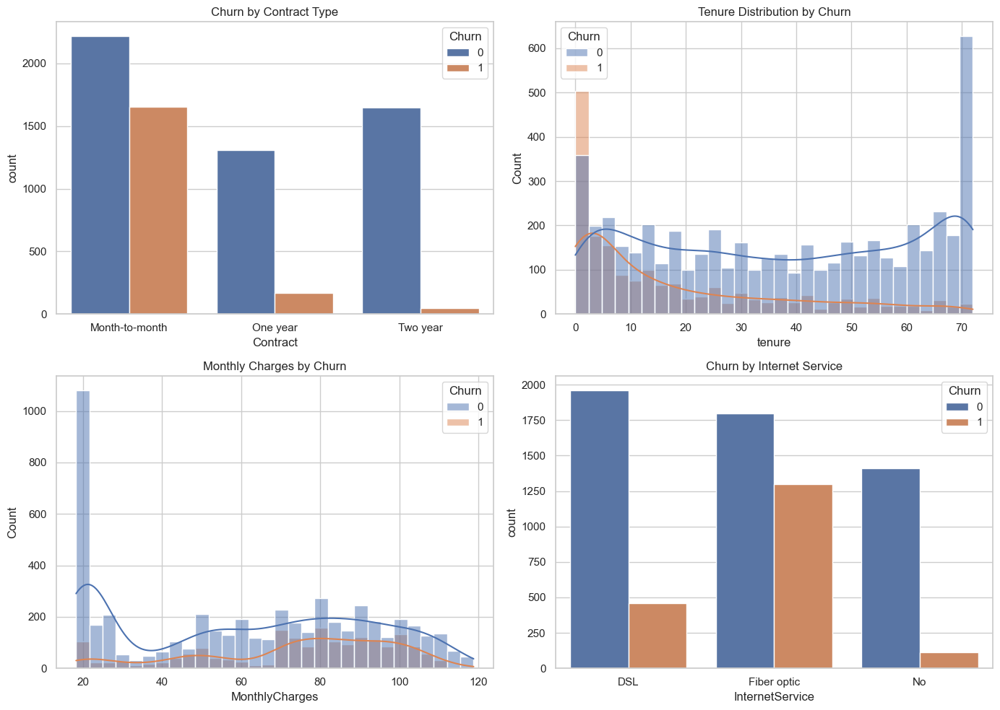
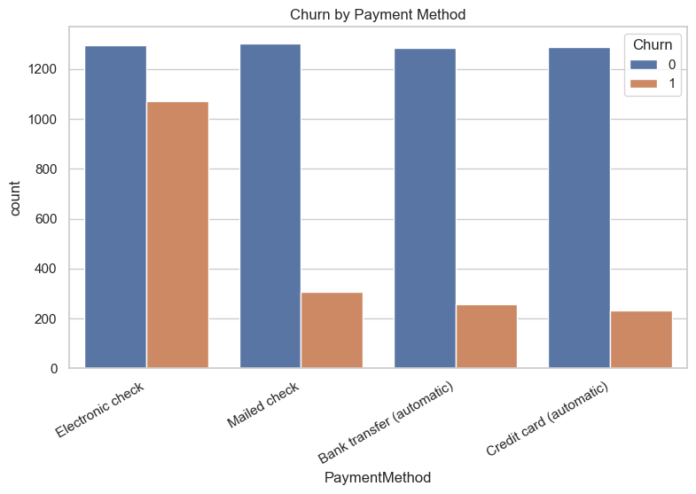
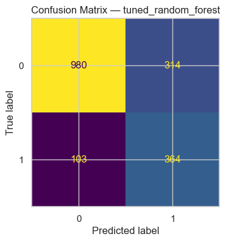

# Telecom Customer Churn Prediction using Machine Learning

## Project Overview

Customer churn is a major challenge for subscription-based businesses such as telecommunications companies. Acquiring new customers is significantly more expensive than retaining existing ones, making churn prediction an important business problem.

This project analyzes telecom customer data to identify patterns associated with customer churn and builds machine learning models to predict whether a customer is likely to leave the service. The goal is to combine exploratory data analysis and predictive modeling to generate insights that can help businesses improve customer retention strategies.

---

## Project Objectives

The main objectives of this project are:

- Analyze factors that influence customer churn
- Perform exploratory data analysis to understand customer behavior
- Build classification models to predict churn
- Improve model reliability using proper preprocessing and evaluation techniques
- Translate model results into actionable business insights

---

## Dataset

The dataset used in this project is the **Telco Customer Churn dataset**.

It contains customer-level information about telecom services, including:

- Customer tenure
- Contract type
- Payment method
- Internet service type
- Monthly charges
- Total charges
- Demographic information
- Additional subscribed services

### Target Variable

**Churn**

- **Yes** → Customer left the service  
- **No** → Customer stayed with the service

---

## Exploratory Data Analysis

Exploratory Data Analysis (EDA) was performed to identify patterns related to customer churn.

### Key Observations

- Customers with **month-to-month contracts** churn more frequently.
- **Low-tenure customers** show significantly higher churn rates.
- Customers with **higher monthly charges** are more likely to leave the service.
- **Fiber optic internet users** exhibit higher churn rates.
- Customers using **electronic check payments** churn more often.

These patterns suggest that contract flexibility, service cost, and payment methods play an important role in customer retention.

---

## Machine Learning Workflow

The project follows a structured machine learning workflow to ensure reliable and reproducible results.

### Data Preprocessing

The preprocessing pipeline includes:

- Handling missing values
- Scaling numerical variables
- Encoding categorical variables
- Splitting the dataset before preprocessing to prevent data leakage
- Implementing transformations using **Scikit-Learn Pipeline and ColumnTransformer**

---

## Models Implemented

Two classification models were implemented and evaluated:

- **Logistic Regression**
- **Random Forest**

Hyperparameter tuning was performed using **RandomizedSearchCV** to improve model performance.

---

## Model Evaluation

Because churn prediction is an **imbalanced classification problem**, multiple evaluation metrics were used:

- Accuracy
- Precision
- Recall
- F1 Score
- ROC-AUC
- Precision-Recall AUC

Threshold tuning was also applied to improve churn detection performance.

---

## Visual Results

### Customer Churn Distribution



### Churn Analysis by Feature



### ROC Curve

The ROC curve shows the trade-off between true positive rate and false positive rate for the churn prediction model.


### Confusion Matrix

The confusion matrix helps visualize how well the model distinguishes between churned and non-churned customers.



### Feature Importance

The following plot highlights the most important features contributing to churn prediction.


---

## Model Interpretation

Feature importance and model coefficients were analyzed to understand which factors contribute most strongly to churn.

Important predictors include:

- Contract type
- Customer tenure
- Monthly charges
- Internet service type
- Payment method

These variables provide insights into customer behaviors that are most associated with churn risk.

---

## Business Insights

Based on the analysis and predictive modeling results, several patterns were identified among customers who are more likely to churn.

High-risk customers often have:

- Short tenure
- Month-to-month contracts
- Higher monthly charges
- Fiber optic internet service
- Electronic check payment method

### Potential Retention Strategies

- Encourage customers to switch to **long-term contracts**
- Improve onboarding experiences for **new customers**
- Promote **automatic payment methods**
- Investigate potential service quality issues among **fiber optic users**

These strategies can help businesses reduce churn and improve customer lifetime value.

---

## Repository Structure

```
customer-churn-prediction
│
├── data
│   └── telco_churn.csv
│
├── notebooks
│   └── churn_analysis.ipynb
│
├── README.md
├── requirements.txt
```

---

## Technologies Used

- Python
- Pandas
- NumPy
- Scikit-learn
- Matplotlib
- Seaborn
- Jupyter Notebook

---

## How to Run the Project

1. Clone the repository

```
git clone https://github.com/growithanand/customer-churn-prediction.git
```

2. Navigate to the project directory

```
cd customer-churn-prediction
```

3. Install dependencies

```
pip install -r requirements.txt
```

4. Launch Jupyter Notebook

```
jupyter notebook notebooks/churn_analysis.ipynb
```

---

## Limitations

- The model relies only on the features available in the dataset.
- External factors such as customer satisfaction or competitor pricing were not included.
- Results may vary depending on dataset quality and real-world customer behavior.

---

## Future Improvements

Potential future enhancements include:

- Testing advanced models such as **XGBoost or LightGBM**
- Using **SHAP values** for deeper model interpretability
- Building a **dashboard for churn monitoring**
- Implementing **cost-sensitive churn optimization**

---

## Author

**Anand**

