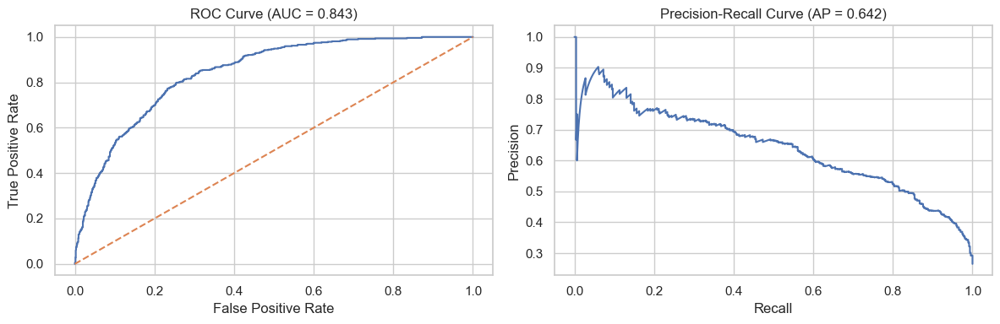
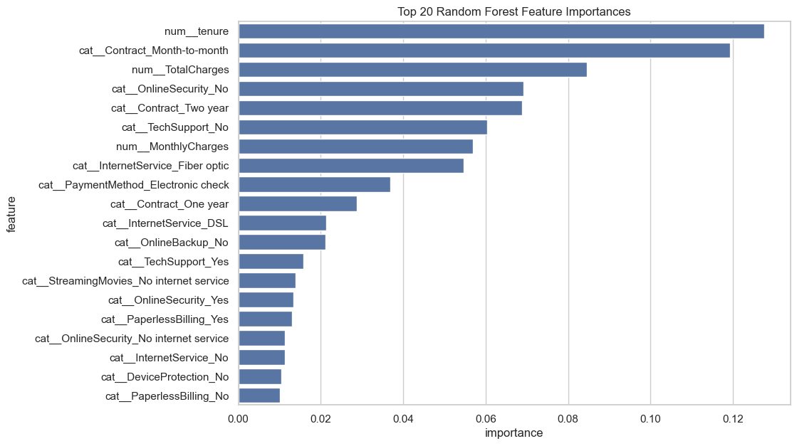

# Telecom Customer Churn Prediction using Machine Learning

## Project Overview

Customer churn is a major challenge for subscription-based businesses such as telecommunications companies. Retaining existing customers is typically more cost-effective than acquiring new ones, making churn prediction an important business problem.

This project analyzes telecom customer data to identify patterns associated with churn and builds machine learning models to predict whether a customer is likely to leave the service. The analysis combines exploratory data analysis (EDA) and predictive modeling to generate insights that can support more effective customer retention strategies.

---

## Project Objectives

The main objectives of this project are:

- Analyze factors associated with customer churn
- Perform exploratory data analysis to better understand customer behavior
- Build classification models to predict churn
- Improve model reliability using proper preprocessing and evaluation techniques
- Translate model results into actionable business insights

---

## Dataset

The project uses the **Telco Customer Churn dataset**, which contains customer-level information about telecom services.

The dataset includes features such as:

- Customer tenure
- Contract type
- Payment method
- Internet service type
- Monthly charges
- Total charges
- Demographic information
- Additional subscribed services

### Target Variable

**Churn**

- **Yes** → Customer left the service  
- **No** → Customer remained with the service

---

## Exploratory Data Analysis

Exploratory Data Analysis (EDA) was performed to identify patterns related to customer churn.

### Key Observations

- Customers with **month-to-month contracts** churn significantly more often
- **Low-tenure customers** show higher churn probability
- Customers with **higher monthly charges** are more likely to leave the service
- **Fiber optic internet users** exhibit higher churn rates
- Customers using **electronic check payments** churn more frequently

These findings suggest that contract flexibility, pricing, and payment behavior play an important role in customer retention.

---

## Machine Learning Workflow

The project follows a structured machine learning workflow to ensure reliable and reproducible results.

### Data Preprocessing

The preprocessing pipeline includes:

- Handling missing values
- Scaling numerical variables
- Encoding categorical variables
- Splitting the dataset before preprocessing to prevent data leakage
- Implementing transformations using **Scikit-Learn Pipeline and ColumnTransformer**

### Models Implemented

Two classification models were implemented and evaluated:

- **Logistic Regression**
- **Random Forest**

Hyperparameter tuning was performed using **RandomizedSearchCV** to improve model performance.

---

## Model Evaluation

Since churn prediction is an **imbalanced classification problem**, multiple evaluation metrics were used:

- Accuracy
- Precision
- Recall
- F1 Score
- ROC-AUC
- Precision-Recall AUC

Threshold tuning was also applied to improve churn detection performance.

---

## Visual Results

### Customer Churn Distribution


### Churn Patterns Across Key Features


### ROC and Precision-Recall Curves

The ROC curve illustrates the trade-off between the true positive rate and false positive rate, while the Precision-Recall curve is particularly useful for evaluating performance on imbalanced classification problems.



### Confusion Matrix

The confusion matrix visualizes how well the model distinguishes between churned and non-churned customers.


### Feature Importance

The following plot highlights the most influential features used by the model to predict churn.



---

## Model Interpretation

Model interpretation was used to identify the variables that contribute most strongly to churn predictions.

Important predictors include:

- Contract type
- Customer tenure
- Monthly charges
- Internet service type
- Payment method

These variables provide insight into the customer characteristics most strongly associated with churn risk.

---

## Business Insights

Based on the analysis and predictive modeling results, several patterns were identified among customers who are more likely to churn.

High-risk customers often have:

- Short tenure
- Month-to-month contracts
- Higher monthly charges
- Fiber optic internet service
- Electronic check payment method

### Potential Retention Strategies

- Encourage customers to switch to **long-term contracts**
- Improve onboarding experiences for **new customers**
- Promote **automatic payment methods**
- Investigate potential service quality issues among **fiber optic users**

These strategies can help businesses reduce churn and improve customer lifetime value.

---

## Repository Structure

```text
customer-churn-prediction
│
├── data
│   └── telco_churn.csv
│
├── notebooks
│   └── churn_analysis.ipynb
│
├── images
│   ├── EDA_1.png
│   ├── EDA_1.1.png
│   ├── ROC_&_PR_curves.png
│   ├── confusion_matrix_visualization.png
│   └── Frature_importance.png
│
├── README.md
├── requirements.txt
```

---

## Technologies Used

- Python
- Pandas
- NumPy
- Scikit-learn
- Matplotlib
- Seaborn
- Jupyter Notebook

---

## How to Run the Project

1. Clone the repository

```bash
git clone https://github.com/growithanand/customer-churn-prediction.git
```

2. Navigate to the project directory

```bash
cd customer-churn-prediction
```

3. Install dependencies

```bash
pip install -r requirements.txt
```

4. Launch the notebook

```bash
jupyter notebook notebooks/churn_analysis.ipynb
```

---

## Limitations

- The model relies only on the features available in the dataset
- External factors such as customer satisfaction, service outages, or competitor actions were not included
- Threshold tuning in the notebook is simplified and could be improved with a separate validation approach
- Results may vary depending on dataset quality and real-world customer behavior

---

## Future Improvements

Potential future enhancements include:

- Testing advanced models such as **XGBoost** or **LightGBM**
- Improving threshold selection using a dedicated validation set
- Building a dashboard for churn monitoring
- Exploring cost-sensitive churn optimization

---

## Author

**Anand**